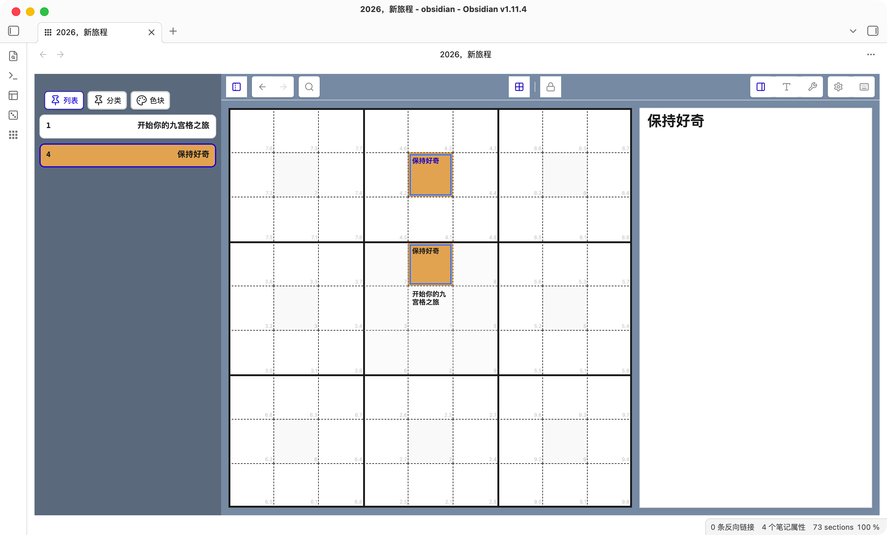

# Mandala Grid
Mandala Grid 是一款 Obsidian 插件，用九宫格/曼陀罗视图来组织与编辑 Markdown 内容，适合进行主题拆解、层级梳理与结构化写作。

## Usage
使用功能按钮、文件右键菜单或命令面板打开 Mandala Grid 视图，进行主题与子主题的编辑与交换。

## Status
本插件仍在完善中，并非所有功能都已可用。下一步计划是完善右键菜单栏功能。

## Acknowledgements
特别感谢 Lineage 插件及其作者 ycnmhd。本插件是在 Lineage 的基础上进行改进与扩展，承袭其核心理念与实现细节。
