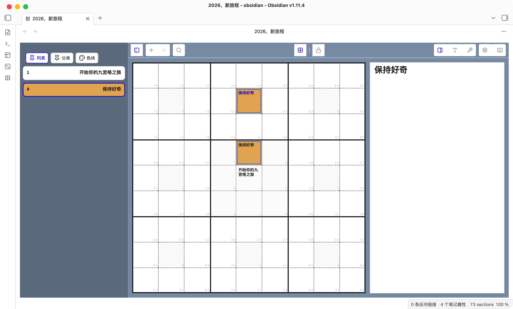

# Mandala Grid
Mandala Grid 是一款 Obsidian 插件，用九宫格/曼陀罗视图来组织与编辑 Markdown 内容，适合进行主题拆解、层级梳理与结构化写作。

## Usage
- 可通过功能按钮、文件右键菜单或命令面板打开 Mandala Grid 视图。
- 支持在九宫格中进行主题与子主题的编辑、交换、固定与颜色标记。
- 支持「日计划」模板场景，可通过命令面板触发相关功能。

## Compatibility
- 同一份内容可在树状视图与九宫格视图之间切换使用。
