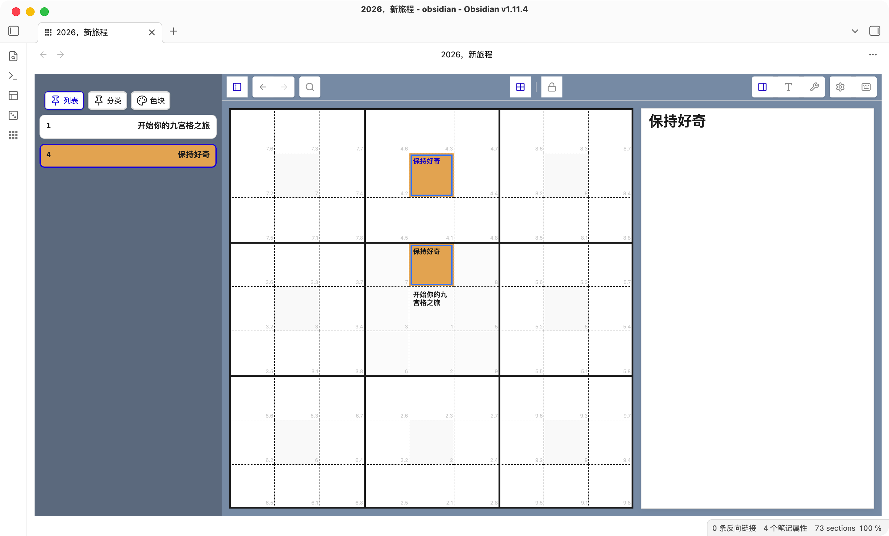

# Mandala Grid

Mandala Grid is an Obsidian plugin that organizes Markdown content in 3x3 and 9x9 mandala layouts for structured thinking, topic breakdown, and writing workflows.

It lets you switch between tree and mandala views, edit cells in place, swap or pin nodes, apply section colors, and use a day-plan template flow inside the same document.

Mandala Grid 是一款 Obsidian 插件，用九宫格/曼陀罗视图来组织与编辑 Markdown 内容，适合进行主题拆解、层级梳理与结构化写作。

## Usage
- Open the Mandala Grid view from the toolbar button, file context menu, or command palette.
- Edit, swap, pin, and color-mark topics and subtopics directly inside the mandala grid.
- Use the day-plan template scene from the command palette when you want a daily planning workflow.

- 可通过功能按钮、文件右键菜单或命令面板打开 Mandala Grid 视图。
- 支持在九宫格中进行主题与子主题的编辑、交换、固定与颜色标记。
- 支持「日计划」模板场景，可通过命令面板触发相关功能。

## Compatibility
- The same content can be viewed and edited in both the tree view and the mandala grid view.

- 同一份内容可在树状视图与九宫格视图之间切换使用。
